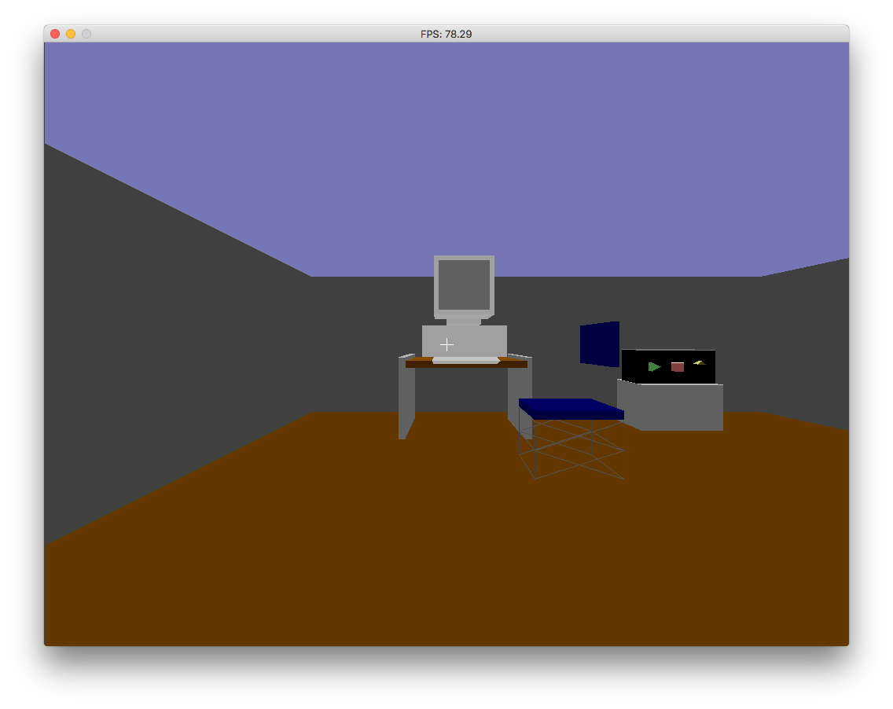

# Virtual Reality Project

> Work in progress.

This project revives a small DOS-era software 3D renderer originally written
around 1993-94. The recovered C source has been converted to C++14, and the DOS
graphics and input code has been replaced with SDL2 while retaining the
project's software-rendering approach.

The source was reconstructed from a paper copy using OCR. See
[Project History](docs/history.md) for the recovery story and the major changes
made since the original version.



## Quick Start

The project requires CMake 3.16 or newer, a C++14 compiler, and SDL2 development
files. Build and run the cube world from the repository root:

```sh
./build_debug.sh
./build/debug/run_vr_project --file res/cube.txt
```

Run the tests after building:

```sh
ctest --test-dir build/debug --output-on-failure
```

See [Development](docs/development.md) for release builds, direct CMake and
Makefile commands, command-line options, code-quality tools, and CI details.

## Controls

| Input | Action |
| --- | --- |
| Up arrow | Move forward. |
| Down arrow | Move backward. |
| Left arrow | Turn left. |
| Right arrow | Turn right. |
| Left Alt + Left/Right | Strafe left or right. |
| Left Shift + movement key | Move or turn faster. |
| Escape | Exit. |
| Left mouse button | Select an object; select the same object again to activate its legacy outcome. |

Legacy outcome commands are printed rather than executed.

## Sample Worlds

The repository includes three sample world files:

| File | Contents |
| --- | --- |
| `res/cube.txt` | A small solid and wireframe cube example. |
| `res/office.txt` | A larger room demonstrating multiple meshes and instances. |
| `res/teapot.txt` | A higher-polygon teapot imported from Wavefront data. |

## Documentation

- [World File Format](docs/world-format.md) describes how to create scene files.
- [Architecture](docs/architecture.md) maps modules, ownership, and runtime flow.
- [Rendering Pipeline](docs/rendering-pipeline.md) traces transformation through rasterisation.
- [Development](docs/development.md) covers building, testing, tooling, and project layout.
- [Project History](docs/history.md) records the original project and its restoration.

## License

This project is available under the [MIT License](LICENSE).
